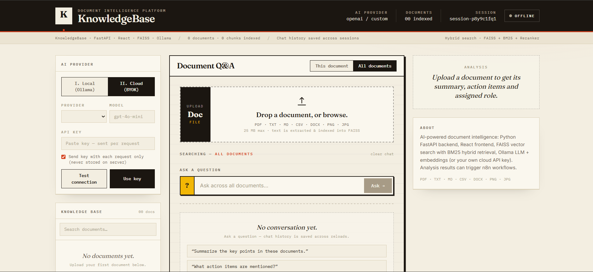

# ⚡ KnowledgeBase


An AI-powered document intelligence platform to ingest, understand, and get actionable insights from your documents.

Upload a file → get an instant **summary**, **action items**, and **assigned role** → ask questions with **source citations**.



## ✨ Features

- 📄 **File Ingestion**: Upload documents (PDF, TXT, MD, CSV, DOCX, PNG, JPG).
  - PDF text extraction + scanned-PDF OCR fallback, DOCX tables, CSV rows, image OCR via Tesseract.
- 🧠 **AI Analysis**: Automatically generates a summary, extracts key action items, and suggests a relevant role for handling the document.
- 🗄️ **Persistent Knowledge Base**: Documents are chunked and stored in a searchable FAISS vector index with BM25 hybrid search + cross-encoder reranking.
- 💬 **Conversational Q&A**: Chat interface to ask questions about a single document or across all documents, with source citations and persistent SQLite chat history.
- 🔄 **Local or Cloud LLM (BYOK)**: Run fully local with Ollama by default, or bring your own API key for OpenAI, Anthropic, Google Gemini, Groq, Mistral, OpenRouter, or any OpenAI-compatible gateway — per-request or as server default.
- 🔗 **Automation Ready**: Triggers n8n webhooks with the analysis results to enable downstream automation workflows.

## 🧰 Tech Stack

- **Backend**: Python + FastAPI, LangChain, FAISS, BM25 (`rank_bm25`), Sentence-Transformers reranker, SQLite chat store
- **Frontend**: React + Vite + TailwindCSS, Axios, React-Markdown
- **LLM / Embeddings**: Ollama (`llama3` + `mxbai-embed-large` by default), optional cloud providers via BYOK
- **OCR / Parsing**: Tesseract OCR, Poppler (`pdf2image`), `pypdf`, `python-docx`, Pillow

## 🧰 Prerequisites

Before you begin, ensure you have the following installed:

1. **Python 3.8+**: [Download Python](https://www.python.org/downloads/)
2. **Node.js 18+**: for the React frontend
3. **Ollama**: for local LLM + embeddings. [Download Ollama](https://ollama.com/)
4. **Tesseract OCR**: required for image / scanned-PDF text extraction.
   - **Windows**: Download from [here](https://github.com/UB-Mannheim/tesseract/wiki). Add the install path to `PATH`.
   - **macOS**: `brew install tesseract`
   - **Linux**: `sudo apt-get install tesseract-ocr`
5. **Poppler**: required by `pdf2image` for scanned-PDF OCR fallback.
   - **Windows**: See [poppler-windows releases](https://github.com/oschwartz10612/poppler-windows/releases/). Add `\bin` to `PATH`.
   - **macOS**: `brew install poppler`
   - **Linux**: `sudo apt install poppler-utils`

## ⚙️ Setup and Installation

### 1. Pull required Ollama models

```bash
ollama pull llama3
ollama pull mxbai-embed-large:335m
```

Ensure Ollama is running (`ollama serve`) in the background.

### 2. Backend setup

```bash
cd backend-python
python -m venv venv

# Windows:
.\venv\Scripts\activate
# macOS/Linux:
# source venv/bin/activate

pip install -r requirements.txt
cp .env.example .env   # then edit .env if needed
python main.py
```

Backend runs on `http://localhost:8000`.

Key `.env` options:

| Variable | Default | Purpose |
|---|---|---|
| `LLM_PROVIDER` / `LLM_MODEL` | `ollama` / `llama3` | Chat model |
| `EMBEDDING_PROVIDER` / `EMBEDDING_MODEL` | `ollama` / `mxbai-embed-large:335m` | Embeddings (changing this after indexing requires clearing the FAISS index) |
| `ENABLE_HYBRID_SEARCH` / `ENABLE_RERANKER` | `true` | BM25 hybrid + cross-encoder rerank |
| `RETRIEVAL_K` / `RERANK_TOP_N` | `20` / `5` | Retrieval depth / final passages |
| `CHUNK_SIZE` / `CHUNK_OVERLAP` | `900` / `150` | Document chunking |
| `MAX_FILE_MB` | `25` | Upload limit |
| `ANALYSIS_ROLES` | Finance/Customer/Safety/HR/Legal/... | Roles the AI can assign a document to |
| `N8N_WEBHOOK_URLS_JSON` | `[]` | n8n webhook URLs for analysis results |
| `CORS_ORIGINS` | `http://localhost:5173,...` | Allowed frontend origins |

### 3. Frontend setup

In a new terminal:

```bash
cd frontend-react
npm install
npm run dev
```

Frontend runs on `http://localhost:5173`.

## 🚀 Usage

1. **Upload a document** — drag & drop or browse (PDF, TXT, MD, CSV, DOCX, PNG, JPG, max 25 MB).
2. **Review AI analysis** — summary, action items, assigned role appear in the Analysis panel. Results are also POSTed to configured n8n webhooks.
3. **Ask questions**:
   - `This document` — scoped search inside the selected file.
   - `All documents` — hybrid search across the whole knowledge base.
   - Answers include `[Source: filename, Page N]` citations. If the answer is not in the documents, the API says so instead of hallucinating.
4. **Manage knowledge base** — search/delete documents from the Knowledge Base list, clear chat sessions.
5. **Switch AI provider** — use the AI Provider panel:
   - `Local (Ollama)` — private, free, no key.
   - `Cloud (BYOK)` — OpenAI / Anthropic / Gemini / Groq / Mistral / OpenRouter / custom gateway. Keys can be sent per-request only (never stored) or saved as server default via `PUT /api/provider`. Test any config with `POST /api/provider/test`.

## 🔌 API Endpoints

| Method | Path | Description |
|---|---|---|
| GET | `/api/health` | LLM/embeddings/reranker/index status |
| GET | `/api/stats` | Document + chat counts |
| POST | `/api/upload-and-process` | Upload + analyze + index a document |
| GET | `/api/documents` | List indexed document names |
| GET | `/api/documents/stats` | Index stats |
| GET | `/api/documents/{filename}` | Document detail (chunks/pages/chars/preview) |
| DELETE | `/api/documents/{filename}` | Delete one document + its chunks |
| POST | `/api/documents/clear?confirm=true` | Delete entire index + uploads |
| POST | `/api/chat` | RAG Q&A (`query`, `session_id`, optional `filter_source` + per-request BYOK fields) |
| GET | `/api/chat/sessions` | List chat sessions |
| GET | `/api/chat/sessions/{id}` | Get transcript |
| GET | `/api/chat/sessions/{id}/export` | Export transcript as Markdown |
| DELETE | `/api/chat/sessions/{id}` | Delete a session |
| GET | `/api/providers` / `/api/provider` | Provider catalogue + active config (keys masked) |
| PUT | `/api/provider` | Switch provider/model/keys at runtime |
| POST | `/api/provider/test` | Smoke-test a provider config |

Sample data to try is in `sampledata/` (complaints, quotations, government orders, incident report).

## 📁 Project Structure

```
KnowlegeBase/
├── backend-python/
│   ├── main.py            # FastAPI app, lifespan, CORS, rate limits
│   ├── config.py          # Central settings (.env)
│   ├── providers.py       # Local Ollama + BYOK provider abstraction
│   ├── retrieval.py       # Hybrid FAISS + BM25 + rerank pipeline
│   ├── utils.py           # Extraction, chunking, n8n webhooks
│   ├── chat_store.py      # SQLite persistent chat history
│   ├── models.py          # Pydantic schemas
│   ├── routers/           # documents / chat / provider routes
│   └── requirements.txt
├── frontend-react/
│   └── src/
│       ├── App.jsx
│       └── components/    # Masthead, Shelf, FileUpload, AnalysisResult, Qa, ChatHistory, ProviderToggle
├── sampledata/            # Example documents for testing
└── Screenshot.png
```

## ⚠️ Notes

- Changing the embedding model after documents are indexed causes a dimension mismatch — clear the index (`POST /api/documents/clear?confirm=true` or delete `vector_store.faiss/`) and re-upload.
- Uploaded files are served from `/files` when `SERVE_FILES=true`. For LAN exposure, bind appropriately and restrict CORS.
- Provider API keys in `provider_config.json` are stored locally with `0600` permissions where supported — prefer per-request BYOK mode if on a shared machine.
